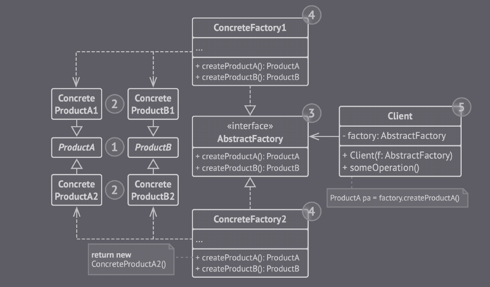

## Abstract Factory

O Abstract Factory é um padrão de projeto criacional que permite que você produza famílias de objetos relacionados sem ter que especificar suas classes concretas.

 
(Abstract Factory - Imagem retirada do livro *Mergulhando nos padrões de projeto Alexander Shvets* - https://refactoring.guru/pt-br/design-patterns/book)

Esse padrão deve ser utilizado quando se deseja trabalhar com familia de produtos relacionados, sem depender de classes concretas.

### Vantagens

- Evita um acoplamento forte entre produtos concretos e o código cliente.

- É possível introduzir novas coleções
de produtos sem quebrar o código cliente existente (Princípio aberto/fechado).

- Fácil manutenção pois, o código de criação do produto é isolado para cada coleção (Princípio de responsabilidade única).

### Desvantagens 

- O código se torna complicado, a medida que novas interfaces e classes vão sendo introduzidas.