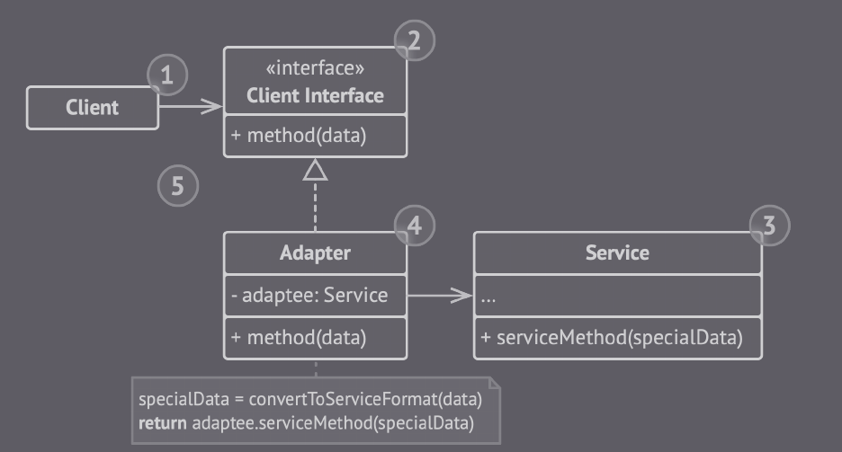

## Adapter

É um padrão do tipo estrutural que permite objetos  imcompatíveis se comunicarem.

O adapter é um objeto especial que traduz a interface de um componente para que outro objeto possa entender.

- O cliente possui uma interface que descreve como outras classes devem seguir para se comunicarem.

- O serviço é geralmente é um código legado ou um serviço de terceiros incompatível com o código do cliente.

- O adpator é uma classe que implementa a interface do cliente e encobre o código do serviço. Ou seja, ele recebe as chamadas do cliente e traduz para o serviço.

### Vantagens

- O código da conversão é isolado do cliente e do serviço (Princípio da responsabilidade única).

- É possível adicionar novos adaptadores sem quebrar o código cliente (Princípio do aberto/fechado).

### Desvantages

- A complexidade do código aumenta, pois é preciso inserir novas classes e objetos para tornar o código compatível.