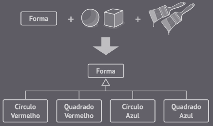
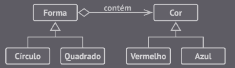
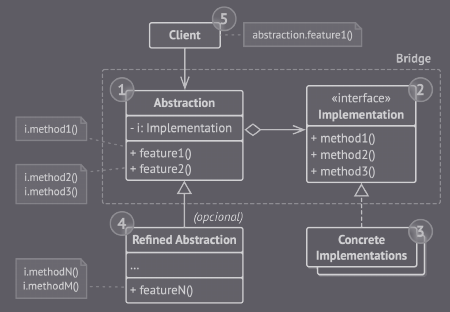

## Bridge

E um padrão estrutural que permite a divisão de uma classe grande em um conjunto de classes pequenas, organizadas em hierarquias e interligadas por abstrações e implementações. 

Essa padrão busca resover um problema muito comum de herança de classes, onde o usuário costuma criar uma especialização específica para cada estado diferente de uma classe.

Dessa forma, o Bridge  resolve esse problema trocando herança por composição, ou seja, os objetos que definem o estado e o comportamento da classe original são isolados.

### Exemplo

Antes:

(Exemplo de problema - Imagem retirada do livro *Mergulhando nos padrões de projeto Alexander Shvets* - https://refactoring.guru/pt-br/design-patterns/book)

Depois:

(Exemplo de solução com o Bridge - Imagem retirada do livro *Mergulhando nos padrões de projeto Alexander Shvets* - https://refactoring.guru/pt-br/design-patterns/book)

A classe original atribui as tarefas para os objetos relacionados, em vez de fazer tudo por conta propria.

Dessa forma, é mais fácil trocar a implementação da hierarquia durante a execução.

(Bridge - Imagem retirada do livro *Mergulhando nos padrões de projeto Alexander Shvets* - https://refactoring.guru/pt-br/design-patterns/book)

### Vantagens

- É possível incluir implementações independentes da plataforma (Princípio aberto/fechado).

- O cliente trabalha com abstrações em alto nível, não ficando dependente de detalhes da plataforma (Princípio de responsabilidade única).

### Desvantagens

- O padrão pode ser complicado de aplicar em classes que são muito coesas.

