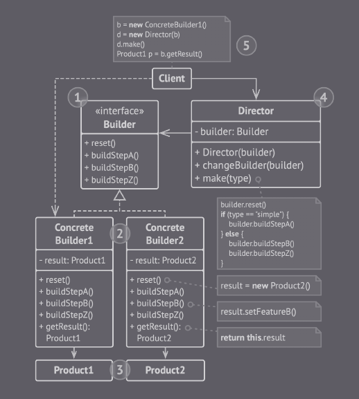

## Builder

Esse padrão, permite a criação de objetos complexos por etapas.

O objetivo principal é atribuir a responsabilidade de criação de um objeto complexo para os *builders* para evitar a criação de construtores grandes e complexos.

Esse tipo de padrão organiza a criação em uma série de etapas impedindo que o cliente tenha acesso ao objeto enquanto o builder estiver construindo.

(Builder - Imagem retirada do livro *Mergulhando nos padrões de projeto Alexander Shvets* - https://refactoring.guru/pt-br/design-patterns/book)

### Diretor

O diretor é uma classe que define uma ordem específica para a criação de objetos. Não é obrigatório ter ele no código, mas ele pode ser um bom lugar para colocar rotinas que são reutilizadas em vários lugar do programa. E também esconde os detalhes da construção do produto no código cliente.

### Vantagens

- Não é preciso chamar todas as etapas de criação, somente as necessárias para uma produção específica.

- Evita sobrecarga de construtores em uma classe.

- O código de criação é isolado da lógica de negócio do produto (Princípio de responsabilidade única).

### Desvantagens

- A complexidade aumenta a medidade que novas classes vão sendo introduzidas.