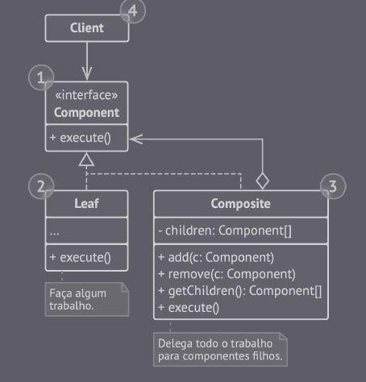

## Composite

É um padrão de projeto do tipo estrutural que permite que um objeto seja estruturado em formato de árvore.

- As folhas são objetos básicos de uma árvore.

- Os contêiners são elementos que possuem sub-elementos: folhas ou outros contêiners.

- O cliente trabalha com todos os elementos através da interface. Dessa forma, ele pode trabalhar tanto com elementos folha ou contêiners da mesma forma.

(Composite - Imagem retirada do livro *Mergulhando nos padrões de projeto Alexander Shvets* - https://refactoring.guru/pt-br/design-patterns/book)

### Vantagens

- É possível introduzir novos elementos na aplicação sem quebrar o código existente (Princípio aberto/fechado).

### Desvantagens

- Pode ser difícil implementar uma interface que seja comum para classes, cuja a interface difere muito. Logo, em alguns cenários é preciso generalizar muito uma interface componente, tornando difícil a compreensão.