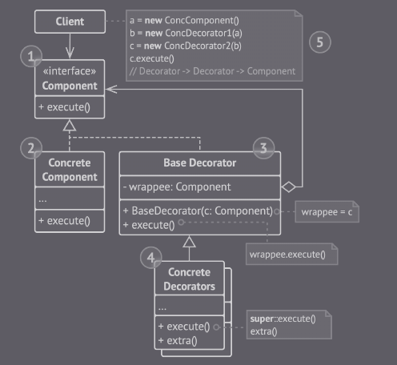

## Decorator

É um padrão de projeto estrutural que permite que a adição ne novos comportamentos em um objeto em tempo de execução.

Um “envoltório” (ing. “wrapper”) é um nome alternativo para o Decorator, e define a ideia principal deste padrão. O wrapper é um objeto que pode ligado em um objeto alvo, pois eles possuem o mesmo conjunto de métodos. Por fim, o wrapper alter o resultado final, executando alguma rotina antes ou depois do retorno final do objeto.

(Decorator - Imagem retirada do livro *Mergulhando nos padrões de projeto Alexander Shvets* - https://refactoring.guru/pt-br/design-patterns/book)

