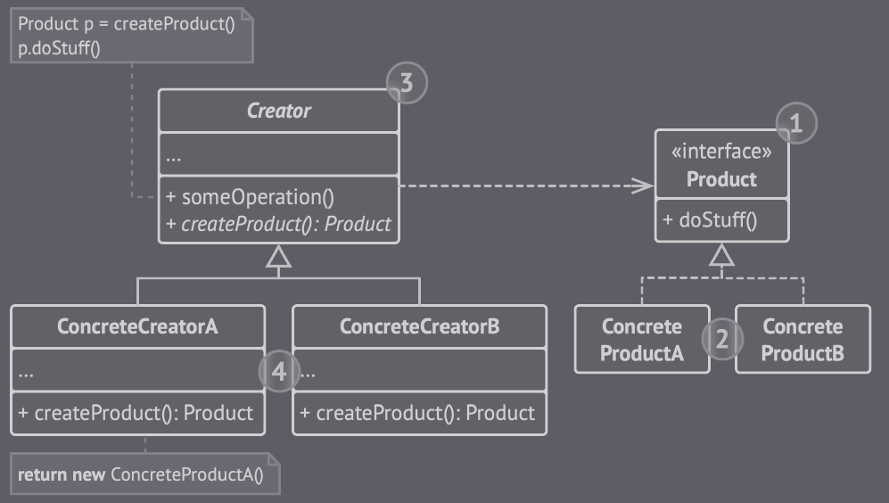

## Factory Method

Este padrão sugere que criação de objetos seja através de chamadas de um método fábrica, em vez do uso do operador *new* de forma direta.s

(Factory Method - Imagem retirada do livro *Mergulhando nos padrões de projeto Alexander Shvets* - https://refactoring.guru/pt-br/design-patterns/book)

O Factory Method separa o código de construção do produto
do código cliente.

Utilizar este padrão quando o objetivo é economizar recursos do sistema reutilizando objetos existentes em vez de recriá-los sempre.

### Vantagens 

- Evita acoplamentos firmes entre o criador e os produtos
concretos

- O código de criação do produto para um único local do programa, facilitando a manutenção do código (Princípio de responsabilidade única).

- Novos tipos de produtos podem ser inseridos no programa sem quebar o código existente (Princípio aberto/fechado).

### Desvantagens
- O código pode se tornar mais complicado, pois você precisa introduzir muitas subclasses novas para implementar o padrão.