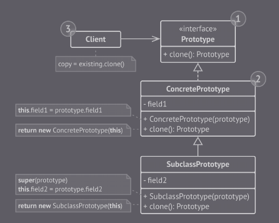

## Prototype

É um padrão de projeto criacional que permite a cópia de objetos sem a dependencias de outras classes.

O padrão Prototype delega o processo de clonagem para o próprio objeto que está sendo clonado.

(Prototype - Imagem retirada do livro *Mergulhando nos padrões de projeto Alexander Shvets* - https://refactoring.guru/pt-br/design-patterns/book)

Ao invés de instanciar uma subclasse que coincide com alguma configuração, o cliente pode simplesmente procurar por
um protótipo apropriado e cloná-lo.

### Vantagens

- A clonagem de objetos pode ser feita sem acoplar a suas classes concretas.

- Evita criação de códigos de inicialização repetidos em troca de clonar protótipos pré-construídos

### Desvantagens

- Clonar objetos complexos que têm referências circulares pode ser bem complicado.