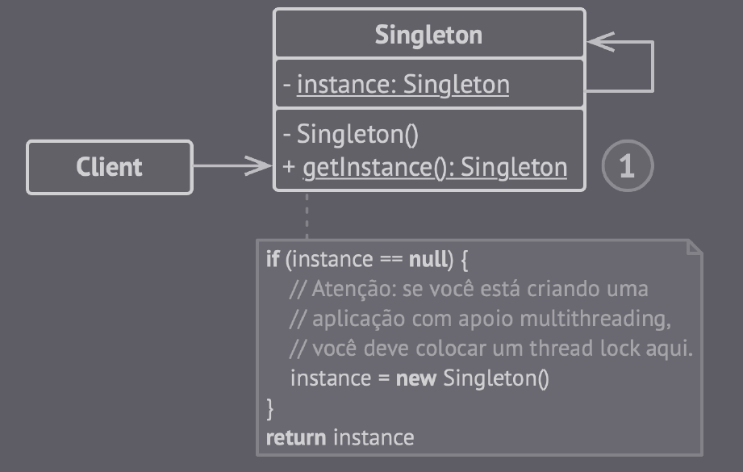

## Singleton

Padrão de projeto que garante que uma classe tenha apenas uma instância, provendo um ponto de acesso global para o código.

Ele quebra o princípio de responsabilidade única para resolver dois problemas: 

- Garantir que uma classe tenha uma única instância, com objetivo de controlar o acesso compartilhado de algum recurso;

- Fornece um ponto de acesso global para aquela instância, permitindo que um objeto seja acessado em qualquer lugar do programa, evitando que seus atributos sejam sobreecritos por outro código;

(Singleton - Imagem retirada do livro *Mergulhando nos padrões de projeto Alexander Shvets* - https://refactoring.guru/pt-br/design-patterns/book)

## Vantagens

- O código ganha um ponto de acesso global para uma instância;

- Objeto singleton é inicializado somente quando for pedido pela primeira vez;

## Desvantagens

- O padrão resolve dois problemas de uma só vez (Viola o princípio de responsabilidade única);

- Singleton pode mascarar um design ruim, por exemplo, quando os componentes do programa sabem muito sobre
cada um;

- O padrão requer tratamento especial em um ambiente multithreaded para que múltiplas threads não possam criar um objeto singleton várias vezes;